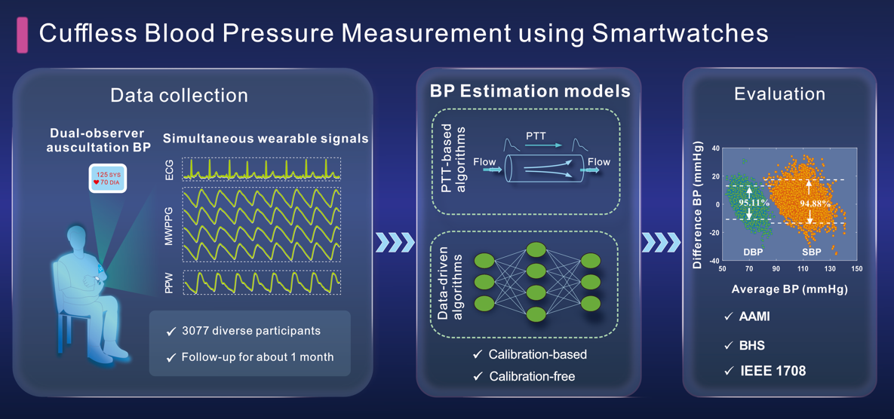

# The CAS-BP Study and Dataset

This repository contains sample data and explanatory for processing the **CAS-BP** dataset released alongside the publication "[Cuffless Blood Pressure Measurement using Smartwatches: A Large-scale Validation Study](#citation)".

The CAS dataset comprises two parts: dataset-1 and dataset-2. Dataset-1 consists of 1272 subjects collected by the Shenzhen Institute of Advanced Technology (SIAT), Chinese Academy of Sciences. Dataset-2 contains 1805 subjects collected by Huawei Technologies Co., Ltd. Dataset-1 (N=1272) is publicly available, whereas dataset-2 is private and not accessible to the public.

Only a very small sample of dataset-1 is provided in this repository, for the purpose of demonstrating the file structure only. For access to the full dataset 1, see the [data access](#data-access) section below.

## Citation

If you use this repository, part or all of the full dataset, and/or our paper as part of your research, please refer to the dataset as the **CAS-BP dataset** and cite the publication as follows:

> Z.-D. Liu Y Li, Y.-T Zhang, J Zeng, Z.-X Chen, Z.-W Cui, J.-K Liu, F Miao, "[Cuffless Blood Pressure Measurement using Smartwatches: A Large-scale Validation Study](https://ieeexplore.ieee.org/document/10129795)," *IEEE Journal of Biomedical and Health Informatics*, vol. 27, no. 9, pp. 4216-4227, 2023.

## Navigation

- [docs](./docs/README.md)
Data file descriptions, a detailed overview of the CAS-BP Study protocol

- [notebook](sample)
Sample Jupyter notebook to read waveform and description files in the [sample](sample) directory

- [sample](sample)
Example data files, provide researchers a direct look at the data format before applying for full data access.

---

## Data Access

CAS-BP dataset part 1 (Dataset-1) is available from the corresponding author upon reasonable request, while CAS-BP dataset part 2 (Dataset-2) is not publicly available due to privacy and commercial considerations. To gain access to the full Dataset-1, please complete form **CAS_BP_Study_Data_Access_Request.pdf** in the repository and send it to fen.miao@siat.ac.cn or fenmiao@uestc.edu.cn. The submitted Data Access Request Form should include the following information:

- Principal investigator information
  - Academic credentials, affiliation, and contact information
  - Curriculum vitae
  - Signature attesting to the accuracy of the data use request
- Additional investigator information
  - Academic credentials, affiliation, contact information
- Research proposal
- Acknowledgement to comply with the Data Use Agreement. The key points of the agreement are as follows:
  - Data sharing is restricted to approved principal investigators and specified investigators. New investigators must be reviewed.
  - The data should only be used within the scope of the stated research proposal.
  - No joining of data with other data sources
  - No attempt to identify participants, contact participants, or reconstruct personally identifiable information
  - Storage with appropriate access control and best practices
  - Publication or presentation of research results using the data is permitted, provided that no confidential information from SIAT and no personal information are included.
  - Any publication or presentation resulting from use of the data should include reference to the CAS-BP Study, with [full reference](#citation) to the source publication when appropriate
  - CAS-BP Study authors and SIAT are not obligated to provide any support or additional materials related to the use of the data.
  - CAS-BP Study authors and SIAT are not liable for any losses, damages, or harms arising from the use of the data.
  - CAS-BP Study authors and SIAT are not responsible or liable for the accuracy, usefulness, or availability of the data.
  - Primary investigator must provide a signature attesting that they have read, understood, and accept the Data Use Agreement.
