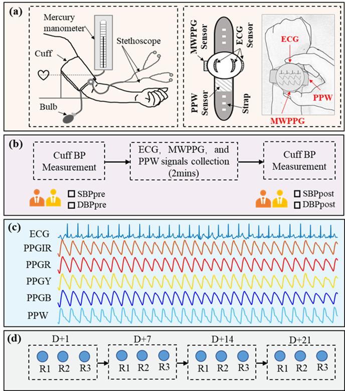

# Protocol and Data Details

## Protocol Overview
With the approval of the Institutional Review Board of the Shenzhen Institute of Advanced Technology, Chinese Academy of Sciences, we recruited 3077 participants for a follow-up blood pressure experiment lasting approximately one month. Each participant underwent three recordings on specific days: D, D+7, D+14, and D+21. During each recording, a smartwatch simultaneously acquired electrocardiogram (ECG), multiwavelength photoplethysmogram (MWPPG), and pulse pressure wave (PPW) signals. The corresponding reference blood pressure (BP) values were measured using a cuff-based, clinically validated dual-stethoscope mercury sphygmomanometer.

The smartwatch utilized in the study was a prototype provided by Huawei Technologies, equipped with an ECG sensor, a PPW sensor, and an MWPPG sensor. The MWPPG signal consisted of four channels: PPGCIR, PPGCR, PPGCY, and PPGCB, which were measured using LEDs with infrared, red, yellow, and blue wavelengths, respectively. The sampling frequency was set at 200 Hz for PPW signals and 1000 Hz for ECG and MWPPG signals.

Simplified steps (detailed can be found in our paper) for each recording are as follows:

- **First BP measurement**: Two trained and mutually blinded observers measured auscultation SBP and DBP from the left upper arm. If the difference in the BP (SBP or DBP) values between the two observers was ≤ 5 mmHg, the average value was used as the reference. Otherwise, the measurement was repeated. The SBP and DBP values measured in this step were denoted as SBPpre and DBPpre, respectively.
- **Signal acquisition**: After the BP measurement, the participant wore a smartwatch on the left wrist for about 2 minutes to simultaneously acquire the ECG, radial PPW, and finger MWPPG signals.
- **Second BP measurement**: After measuring the signals, repeated step (2), and the measured SBP and DBP values were denoted as SBPpost and DBPpost, respectively.

|               | Location            | Device | Sampling frequency |
|:-------------------- |:-------------------- |:-------------------- |:-------------------- |
| ECG | Two ECG electrodes were in contact on the left wrist, while the third electrode was pressed by participant's right thumb. | Huawei smartwatch (a prototype) | 1000 Hz |
| MWPPG | MWPPG sensor was pressed by the participant's right index finger. | Huawei smartwatch (a prototype) | 1000 Hz |
| PPW   | PPW sensor was placed at the radial artery. | Huawei smartwatch (a prototype) | 200 Hz |
| Reference BP   | Left upper arm. | dual-stethoscope mercury sphygmomanometer| - |

## Data File Descriptions
This repository contains a small sample dataset-1, but the complete de-identified dataset-1 is stored elsewhere. To gain access, any researcher may submit a data access request as described in Data Access.

In sample, the main folders are named using unique participant IDs. Subfolders within these main folders are named according to the ID, day and recording numbers, following the naming rule 'ID + day number + recording number'. For example, 'BA2001_1_x', 'BA2001_2_x', 'BA2001_3_x', and 'BA2001_4_x' indicate recordings taken on days D (1), D+7 (2), D+14 (3), and D+21 (4), respectively, for Participant BA2001; 'BA2001_1_1', 'BA2001_1_2', and 'BA2001_1_3' indicate the first, second, and third recording taken on day D, respectively, for Participant BA2001.

Each main folder represents a study participant, and the subfolders contain participant information files and waveform data files.

As an example, participant `BA2001` is illustrated as follows:

    ├── BA2001               <- Participant BA2002
        |── BA2001_1_1          <- Recording 1 of Participant BA2002 collected on day D.
            |── desc.csv      <- Participant BA2001's description file
            |── ppg_ecg.csv      <- Participant BA2001's ECG and PPG waveform file
            |── desc.csv      <- Participant BA2001's PPW waveform file
        |── BA2001_1_2          <- Recording 2 of Participant BA2001 collected on day D.
        |── BA2001_1_3          <- Recording 3 of Participant BA2001 collected on day D.
        |── BA2001_2_1          <- Recording 1 of Participant BA2001 collected on day D+7.
        |── BA2001_2_2          <- Recording 2 of Participant BA2001 collected on day D+7.
        |── BA2001_2_3          <- Recording 3 of Participant BA2001 collected on day D+7.
        |── BA2001_3_1          <- Recording 1 of Participant BA2001 collected on day D+14.
        |── BA2001_3_2          <- Recording 2 of Participant BA2001 collected on day D+14.
        |── BA2001_3_3          <- Recording 3 of Participant BA2001 collected on day D+14.
        |── BA2001_4_1          <- Recording 1 of Participant BA2001 collected on day D+21.
        |── BA2001_4_2          <- Recording 2 of Participant BA2001 collected on day D+21.
        |── BA2001_4_3          <- Recording 3 of Participant BA2001 collected on day D+21.

Please note that not everyone had 12 recordings due to participants dropping out of the experiment or files being deleted as a result of poor signal quality.

### Participant information file
A single file named `desc.csv` containing study participant information including basic demographics, hypertension history and reference BP values for waveform data files.

| Row header            | Data type | Description |
|:-------------------- |:-------------------- |:-------------------- |
| age                  | float                | age, in years        |
| height | float | height, in cm |
| weight | float | weight, in kg |
| gender | string| gender, male or female |
| History of hypertension | boolean| 1=yes, 0=No |
| BP values | float| dual-observer auscultation BP, there are 4 values: SBPpre, DBPpre, SBPpost and DBPpost |

### Waveform data files
There are two files containing raw waveform data: `ppg_ecg.csv` and `ppw.csv`.

`ppg_ecg.csv` contains ECG, PPGCIR, PPGCR, PPGCY, and PPGCB signals.  The sampling rate of both ECG and PPG waveforms is 1000 Hz. Details are as follows:
| Column header            | Data type | Description |
|:-------------------- |:-------------------- |:-------------------- |
| DIFFERENTIAL_TIME            | float         | Relative time, no units     |
| ECG      | float         | ECG signal amplitude, in arbitrary amplifier units |
| PPGCIR      | float         | PPGCIR signal amplitude, in arbitrary amplifier units |
| PPGCR      | float         | PPGCR signal amplitude, in arbitrary amplifier units |
| PPGCY      | float         | PPGCY signal amplitude, in arbitrary amplifier units |
| PPGCB      | float         | PPGCB signal amplitude, in arbitrary amplifier units |

`ppw.csv` contains PPW signals. The sampling rate of the PPW waveform is 200 Hz. Details are as follows:
| Column header            | Data type | Description |
|:-------------------- |:-------------------- |:-------------------- |
| DIFFERENTIAL_TIME            | float         | Relative time, no units     |
| PPW      | float         | PPGW signal amplitude, in arbitrary amplifier units |